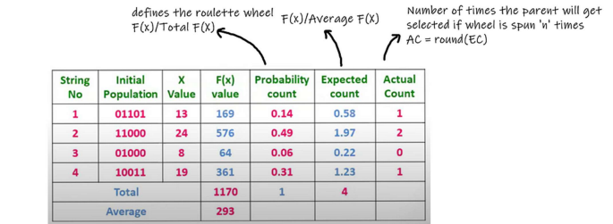
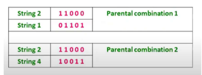
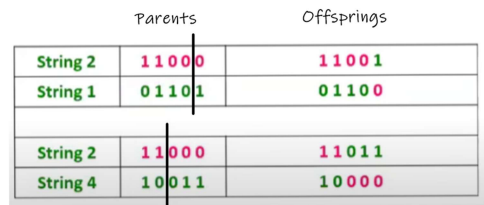
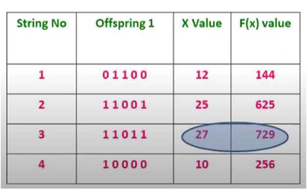
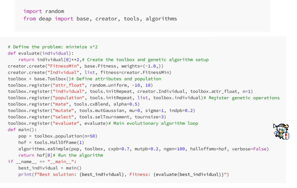

# Evolutionary Algorithms

> I'm shitting my pants while making this

---

---

- [Evolutionary Algorithms](#evolutionary-algorithms)
  - [❓ So what is this really?](#-so-what-is-this-really)
    - [Multiple business benefits are associated with evolutionary algorithms, including](#multiple-business-benefits-are-associated-with-evolutionary-algorithms-including)
    - [Type of Evolutionary Algorithms](#type-of-evolutionary-algorithms)
  - [How evolutionary algorithm works](#how-evolutionary-algorithm-works)
    - [Main characteristic and features](#main-characteristic-and-features)
    - [Core Components of EAs](#core-components-of-eas)
      - [Population](#population)
      - [nature selection](#nature-selection)
      - [Reproduction and Crossover](#reproduction-and-crossover)
      - [Mutations](#mutations)
      - [Genetic algorithms](#genetic-algorithms)
    - [The Genetic Algorithm Process](#the-genetic-algorithm-process)
      - [Step 1: Initialization](#step-1-initialization)
      - [Step 2: Fitness Evaluation](#step-2-fitness-evaluation)
      - [Step 3: Selection](#step-3-selection)
      - [Step 4: Crossover (Recombination)](#step-4-crossover-recombination)
      - [Step 5: Mutation](#step-5-mutation)
      - [Step 6: Replacement](#step-6-replacement)
      - [Step 7: Convergence](#step-7-convergence)
    - [Example Problem](#example-problem)
    - [Example code python](#example-code-python)
  - [Contributors aka Emotionally damaged persons lol](#contributors-aka-emotionally-damaged-persons-lol)

---

## ❓ So what is this really?

An evolutionary algorithm is an AI method inspired by natural evolution. It solves problems by repeatedly improving a group of possible solutions using processes like selection, mutation, and reproduction.

### Multiple business benefits are associated with evolutionary algorithms, including

- **Increased flexibility.** Evolutionary algorithm concepts can be modified and adapted to solve the most complex problems humans face and meet target objectives.
- **Better optimization.** The vast “population” of all possible solutions is taken into consideration. This means the algorithm is not restricted to a particular solution.
- **Unlimited solutions.** Unlike classical methods that present and attempt to maintain a single best
solution, evolutionary algorithms include and can present multiple potential solutions to a
problem.

### Type of Evolutionary Algorithms

- **Genetic Algorithms**: These algorithms are based on the principles of Darwinian natural selection, where solutions with favorable aƩributes are preserved and recombined to produce improved
offspring.
- **Evolution Strategies**: Primarily employed for continuous optimization tasks, evolution strategies focus on dynamically adapting the parameters in the search space to drive optimization
progression.
- Genetic Programming: In this paradigm, computer programs, represented as trees or graphs, are
evolved using analogs of natural genetic operations.

In the AI landscape, evolutionary algorithms serve as a critical tool for tackling a wide array of problem-solving and optimization challenges. Their adaptive nature and capacity to navigate complex solution spaces make them invaluable for various machine learning and AI models. And such will be discussed in this module.

---

## How evolutionary algorithm works

Understanding the inner workings of evolutionary algorithms provides crucial insights into their real-world applicability and potential impact on AI and optimization contexts.

### Main characteristic and features

- **Exploration vs. Exploitation:** Evolutionary algorithms strike a balance between exploration, to discover new promising solutions, and exploitation, to refine and improve existing solutions
- **Exploration vs. Exploitation:** Evolutionary algorithms strike a balance between exploration, to discover new promising solutions, and exploitation, to refine and improve existing solutions
- **Iterative Improvement:** Through iterative generations, the algorithm refines the population,
progressively converging towards high-quality solutions.

### Core Components of EAs

The core operations of evolutionary algorithms encompass **population**, **selection**, **crossover** (recombination), and **mutation**. These operations emulate the fundamental processes in natural evolution, driving the gradual refinement and enhancement of candidate solutions.

#### Population

- Think of a population in evolutionary algorithms like a collection of players in your game, each
representing a potential solution. The population is a diverse set of candidate solutions, and each one
has its unique “genetic makeup” — its specific parameters or features that define it.

- Just like in nature, a larger, more diverse population increases the chance of finding a strong
solution. In essence, the population serves as your starting point in the search for the optimal answer.

#### nature selection

- Natural selection is the process where organisms better adapted to their environment are more likely to survive and reproduce, while weaker ones die off. Over time, this increases the spread of their genes in the population.

#### Reproduction and Crossover

- Reproduction and crossover happen when two parents combine their genes to create a child with mixed traits. This new combination is like a “test” of traits in the environment. If it works well, those genes get passed down to future generations and can spread widely over time.

#### Mutations

- Mutation is when small changes happen in genes as they are copied across generations. These changes can be harmful, but they also create new variations that may be beneficial and increase diversity in a population.

#### Genetic algorithms

- A genetic algorithm is a problem-solving method inspired by natural selection. It improves a group of possible solutions over many generations by selecting the best ones and combining them to create better results. Over time, it “evolves” toward an optimal solution. It’s useful for complex problems that are hard to solve with normal methods.

### The Genetic Algorithm Process

A genetic algorithm goes through a series of steps that mimic natural evolutionary processes to
find optimal solutions. These steps allow the population to evolve over generations, improving the
quality of solutions. Here is a general guideline for how a genetic algorithm proceeds

#### Step 1: Initialization

Start by randomly generating a population of potential
solutions. Each solution is usually represented as a set
of parameters or variables. This step creates a diverse
set of potential solutions to start the algorithm.

#### Step 2: Fitness Evaluation

Next, we need to calculate the fitness of each
individual in the population. Here we use the fitness
function to evaluate how good each solution is. This is
how you assess the quality of the solution, based on
some predefined objective function. For example, if
you’re minimizing a function, lower values of the
function will correspond to higher fitness.

#### Step 3: Selection

Now, select individuals based on their fitness. The higher the fitness, the more likely that individual
is to be selected for reproduction. Techniques like rouleƩe wheel or tournament selection are
common here.

#### Step 4: Crossover (Recombination)

Crossover comes next. By combining the genetic material of selected parents, we apply crossover
techniques to generate new solutions or offspring. Pair up selected individuals to exchange parts
of their solution (like swapping genetic material). This gives birth to new “offspring” solutions that
combine traits of both parents.

#### Step 5: Mutation

Randomly tweak a few individuals in the population by changing some of their parameters. This
helps to introduce new variation and prevents the population from becoming too similar, which
can lead to premature convergence.

#### Step 6: Replacement

We next replace some or all of the old population with the new offspring, by determining which
individuals move on to the next generation.

#### Step 7: Convergence

Over time, the population “evolves” towards an optimal solution. The algorithm ends when it
either finds a sufficiently good solution or when further improvement becomes negligible.
The previous steps 2-6 are looped over for a set number of generations or until a termination
condition is met. This loop allows the population to evolve over time, hopefully resulting in a good
solution.

### Example Problem

- maximize the function **$f(x) = x^2$**, where x value range from 0-31

solution

- Parameters
  - Encoding technique- Binary encoding
  - Selection operator- RouleƩe Wheel Selection
  - Crossover operator- Single point crossover

- Step 1:
  - Set Population size (n) = 4
- Step 2:
  - Initial population (x value) = 13, 24, 8, 19
- Step 3:
  - 
  - We see that if the RouleƩe wheel is spun four times, we’ll get 24 twice and 13 and 19 once. So
possible parental combinations are (24,13) and (24,19).

- step 4:
  - 
- Step 5:
  - 
  - We can see that the maximum f(x) value has increased from 576 to 729
- Step 6:
  - Now we’ll take these four offsprings as parents and repeat the process until our
termination condition is not satisfied.

---

### Example code python

- Here’s another example where we use a genetic algorithm to minimize the function f(x)=x². We’ll be using Python and the popular DEAP library to demonstrate this

In this example, we create a population of individuals, each representing a value of x. The fitness function evaluates how close x²×2 is to zero (minimization).

We use selection, crossover (blending two individuals), and mutation (small Gaussian changes) to evolve the population over generations. The algorithm keeps track of the best solution found.

## Contributors aka Emotionally damaged persons lol

- [Ereasores (AlieeLinux)](https://github.com/AlieeLinux)
  - i hate making this, so so so boorrring!!!
